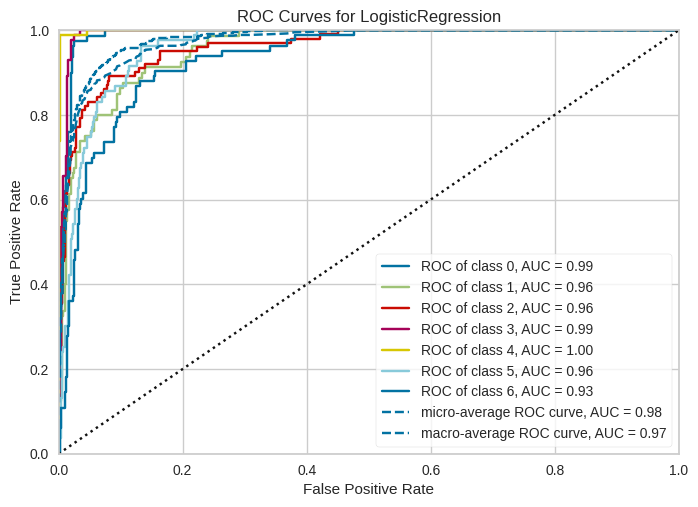
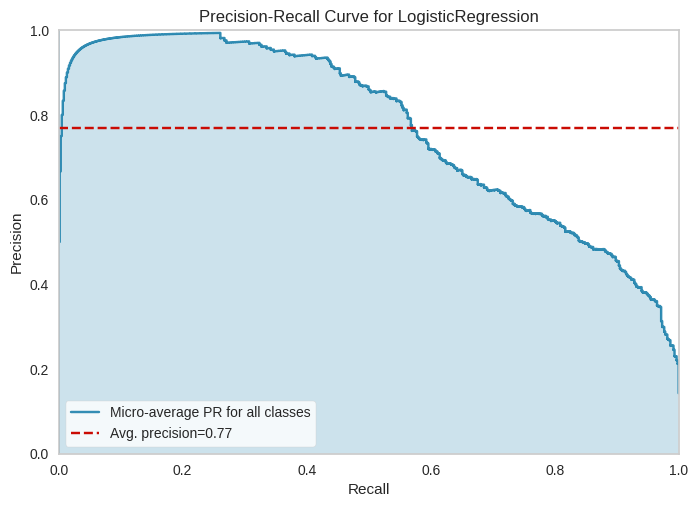
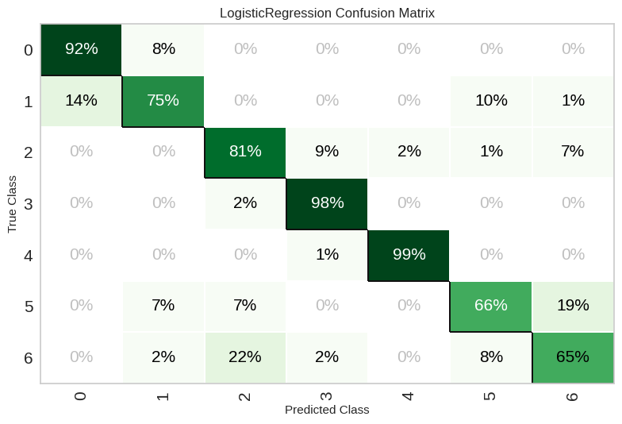
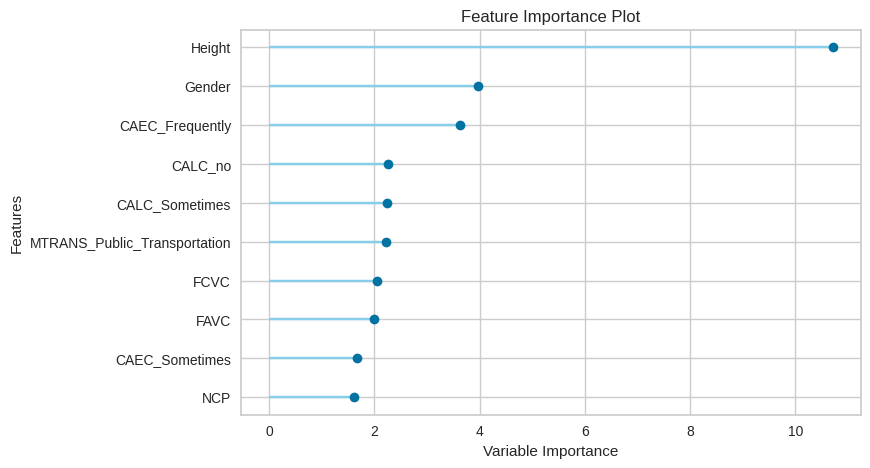
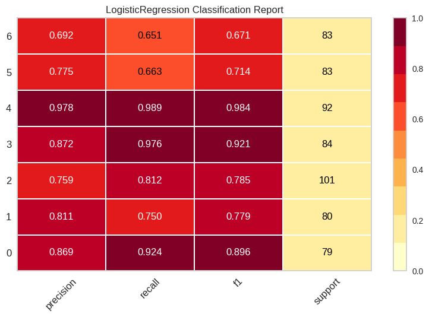

# Clasificación de Obesidad con PyCaret

## Descripción del Proyecto

Este proyecto tiene como objetivo construir un modelo de clasificación para predecir el nivel de obesidad utilizando el conjunto de datos "ObesityDataSet" y la librería PyCaret. El proyecto sigue un flujo de trabajo estándar de ciencia de datos, que incluye la preparación de datos, la comparación de modelos, el ajuste, la visualización, la finalización y la predicción.

## Organización del Proyecto

El proyecto está organizado en las siguientes secciones:

1. **Preparación de Datos:** Carga el conjunto de datos, realiza una división entre conjuntos de entrenamiento y prueba, y configura el entorno de PyCaret.
2. **Comparación de Modelos:** Compara diferentes modelos de clasificación utilizando la función `compare_models()` de PyCaret.
3. **Ajuste del Modelo:** Ajusta los hiperparámetros del modelo seleccionado (Regresión Logística) usando la función `tune_model()` de PyCaret.
4. **Visualización del Modelo:** Genera varios gráficos para analizar el rendimiento del modelo, incluyendo AUC, curva de precisión-recall, matriz de confusión y reporte de clasificación.
5. **Finalización del Modelo:** Finaliza el modelo ajustado usando la función `finalize_model()` de PyCaret.
6. **Predicción:** Realiza predicciones en datos no vistos (30% del conjunto de datos) utilizando el modelo finalizado.
7. **Guardado y Carga del Modelo:** Guarda y carga el modelo finalizado para su uso posterior.
8. **Evaluación del Modelo:** Calcula y muestra varias métricas de evaluación del modelo, incluyendo precisión, recall, puntaje F1 y AUC.

## Visualización del modelo 
### Grafico AUC ( Area under curve )

### Curva de precision-recall

### Matriz de confusion

### Grafico Caracteristicas importantes

### Grafico reporte de clasificación

## Resultados

El modelo de Regresión Logística ajustado y finalizado logró los siguientes resultados en los datos no vistos:

- **Precisión:** 0.7736
- **Recall:** 0.7736
- **Puntaje F1:** 0.7629
- **AUC:** 0.8815

## Conclusiones

El modelo de Regresión Logística demuestra un rendimiento aceptables en la predicción del nivel de obesidad. Las métricas de evaluación indican una precisión y recall aceptables en la predicción de las clases.

## Próximos pasos

- Explorar la posibilidad de utilizar otros modelos de clasificación para comparar su rendimiento.
- Ajustar los hiperparámetros del modelo seleccionado para mejorar aún más su rendimiento.
- Realizar un análisis más profundo de las características importantes para comprender su impacto en la predicción.
- Implementar el modelo en un entorno de producción para su uso en la práctica.
